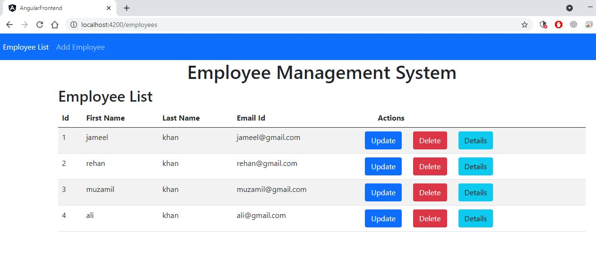
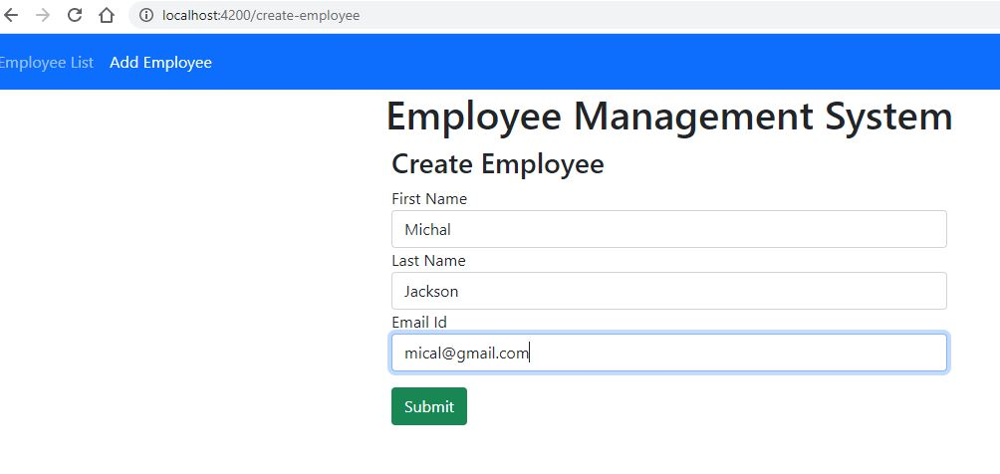
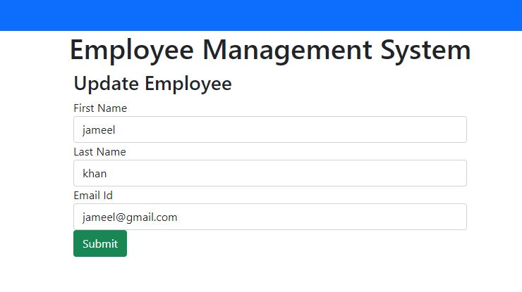

# Employee Management System 

A Simple project which is used to managed the basic information of the employees. The Front-End is developed in Angular and Backend in Springboot

### Main Page

### Add Employee Page

### Update Employee Page

